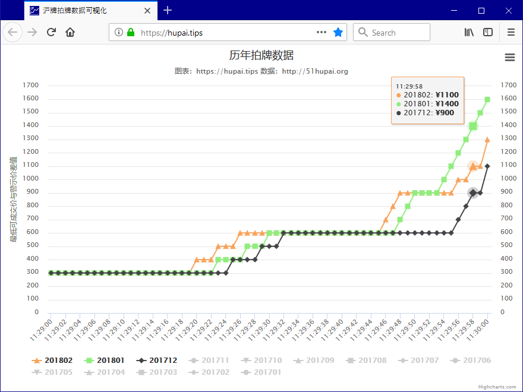

# 沪牌历年拍卖数据可视化 <https://hupai.tips>

图表化展示沪牌历年拍卖数据，为制定拍卖策略提供参考。

## 授权/LICENSE

沪牌拍卖历年数据单独存放在 [pallxk/hupai-data](https://github.com/pallxk/hupai-data) 仓库中，数据来源于[51沪牌](51hupai.org)，版权归51沪牌所有。

网站代码采用 MIT 协议授权，使用网站代码需在网页上保留以下授权声明及 MIT 协议文件 [LICENSE.txt](LICENSE.txt)。

> Copyright 2018 pallxk <github@pallxk.com> https://hupai.tips

网站图标、截图等资源文件采用 [CC BY-NC 4.0 （署名-非商业性使用 4.0 国际）](https://creativecommons.org/licenses/by-nc/4.0/deed.zh) 协议授权。

